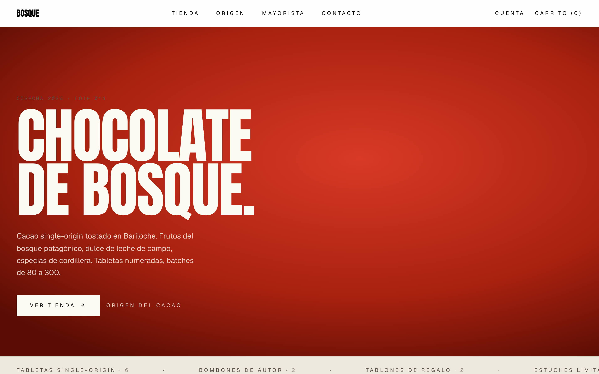
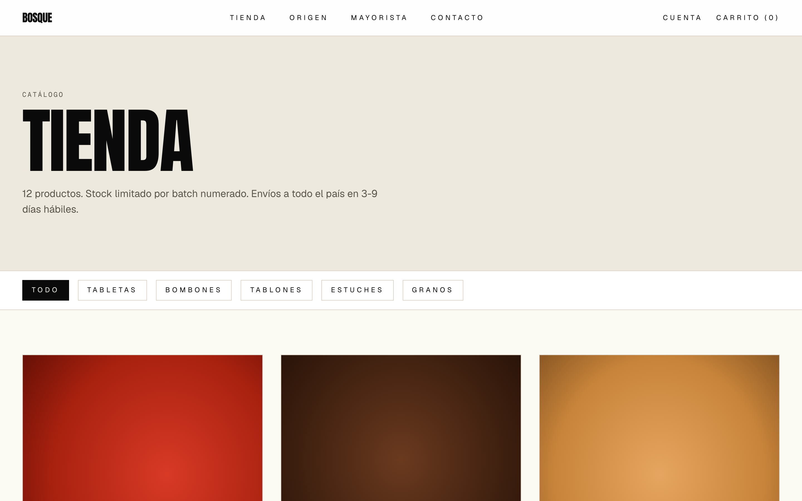
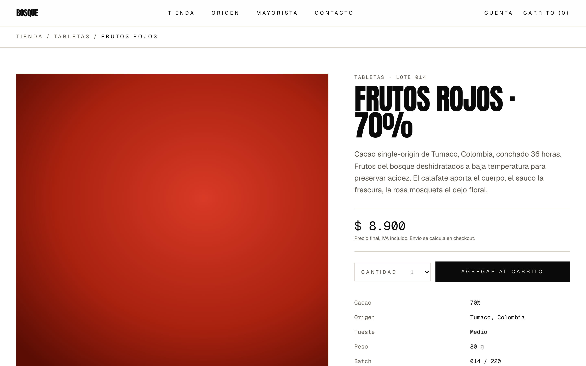

# Bosque

Live: **https://bosque-three.vercel.app**

Demo de tienda online para chocolatería patagónica. Tercera pieza del kit ecommerce AR (junto con [Norhaven Lodge](https://norhaven-lodge.vercel.app) — booking + MP Checkout Pro, y [Cohere](https://cohere-six.vercel.app) — membresías recurrentes con MP Subscriptions).

Construido como showcase técnico y carta de venta para comercios de Bariloche que necesitan alternativa a Tiendanube: stack moderno, customizable real, costo ~$0/mes en free tiers vs ~$15-30k/mes plan básico.

## Pantallas





## Qué muestra

- Catálogo de productos con stock real (12 productos hardcoded como source de verdad + tabla `products` lista para CRUD admin)
- Carrito multi-item server-side con cookie `session_id` firmada HMAC SHA256
- Checkout Mercado Pago Checkout Pro con N items + flag `PAYMENT_MODE=simulated|production` para demo público
- Shipping AR calculado: 3 zonas (CABA+GBA / interior cercano / interior lejano) × 3 carriers (Andreani / Correo Argentino / OCA), derivación automática de zona desde código postal
- Panel admin con stats de órdenes, vista productos, auth por token (`ADMIN_TOKEN` cookie httpOnly 14 días)
- Webhook Mercado Pago con HMAC SHA256 + ts freshness 5min
- Email transaccional Resend (HTML inline editorial) post-pago confirmado
- Identidad visual full-width editorial inspirada en `onyxcoffeelab.com` adaptada a producto patagónico

## Stack

- Next.js 16 (App Router, Turbopack) + TypeScript estricto
- Tailwind CSS v4
- Drizzle ORM + Neon Postgres serverless (provisionado vía Vercel Marketplace integration)
- Mercado Pago Checkout Pro (`mercadopago` SDK 2.x)
- Resend (transactional email)
- Vercel (deploy)
- Vitest (unit) + Playwright (E2E navigation against live)

## Tracking

Tiempo wall-clock activo en [`BUILD_LOG.md`](./BUILD_LOG.md). T-0 = `2026-05-06T16:04:25Z`.

## Setup local

```bash
pnpm install
pnpx vercel link                 # link al proyecto bosque
pnpx vercel env pull .env.local  # baja DATABASE_URL + secretos
pnpm db:migrate                  # aplica schema en Neon
pnpm dev
```

Si querés un Neon propio:

```bash
cp .env.example .env.local
# editar DATABASE_URL, SESSION_SECRET (32+ chars), ADMIN_TOKEN
pnpm db:migrate
pnpm dev
```

## Tests

```bash
pnpm test                                    # vitest unit (4 suites, 30 tests)
PLAYWRIGHT_BASE_URL=https://bosque-three.vercel.app pnpm test:e2e  # navigation E2E
```

## Modo simulated vs production

`PAYMENT_MODE=simulated` (default en deploy público) salta a `/checkout/simulated` con dos botones (aprobado / rechazado) para mostrar el flow completo sin tocar Mercado Pago. `PAYMENT_MODE=production` con `MP_ACCESS_TOKEN` configurado dispara una preferencia MP real y redirige a `init_point`.

## Licencias de tipografía

Las fuentes de heading originalmente apuntaban a **Bajern** (by Anton Bolin, free for personal use, full version paga en Creative Market). El preview free disponible en mirrors solo trae 2 glyphs, así que el demo usa **Anton** (Google Fonts, open-source, condensed bold) como fallback visualmente cercano. Para deploy comercial real bajo cliente, el cliente paga su licencia Bajern o se mantiene Anton.

## Repos relacionados del kit

- Norhaven Lodge: https://github.com/martin-minghetti/norhaven-lodge
- Cohere: https://github.com/martin-minghetti/cohere
